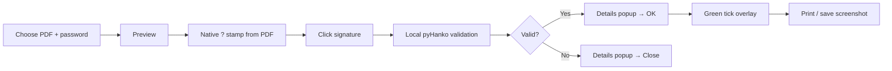
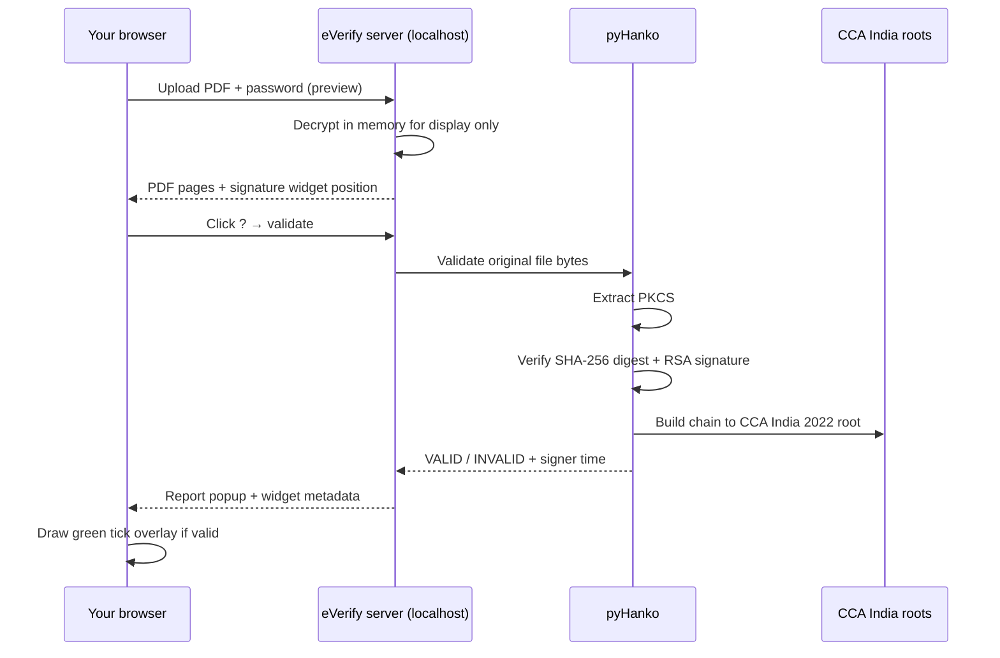

# eVerify

**Local PDF signature verification for password-protected e-Aadhaar documents** — with an Acrobat-style green tick stamp for print/preview, without Adobe Acrobat.

eVerify validates the **UIDAI digital signature** embedded in your downloaded e-Aadhaar PDF using India's **CCA PKI** trust roots. Everything runs **on your machine**. No upload, no cloud, no account.

---

## Why this exists

Photocopy shops and government workflows often use **Adobe Acrobat** to:

1. Open a password-protected e-Aadhaar PDF  
2. **Validate** the digital signature (PKCS#7 / certificate chain)  
3. Show the green **“Signature valid”** stamp  
4. Print a copy that looks “verified”

That works, but Acrobat is **heavy**, often **paid**, and **overkill** if you only need signature validation and a correct validity mark. macOS Preview and most browsers show a **?** for Indian PKI signatures even when the document is **cryptographically valid** — they simply do not ship the **CCA India** root certificates or full Adobe-style signature rendering.

eVerify is a small, local tool that:

- Performs the same **class of cryptographic checks** as Acrobat (via [pyHanko](https://github.com/MatthiasValvekens/pyHanko))  
- Renders an **Acrobat-style green tick** overlay (tuned in the stamp lab)  
- Never modifies your original PDF  

---

## Quick start

### Prerequisites

- **Python 3.10+** (3.11 or 3.12 recommended)  
- macOS, Linux, or Windows with a browser  

### One-time setup

**macOS / Linux**

```bash
git clone https://github.com/danted4/everify.git
cd everify
chmod +x setup.sh
./setup.sh
```

**Windows** (Command Prompt or PowerShell)

```bat
git clone https://github.com/danted4/everify.git
cd everify
setup.bat
```

### Run the viewer

**macOS / Linux**

```bash
./everify-app
```

**Windows**

```bat
everify-app.bat
```

Open **http://127.0.0.1:8765/** in your browser. Your terminal should show `eVerify viewer at http://127.0.0.1:8765/`.

---

## Platform commands

All commands assume you have already cloned the repo and are inside the `everify` folder (`cd everify`).

| Task | macOS | Linux | Windows |
|------|-------|-------|---------|
| **Check Python** | `python3 --version` | `python3 --version` | `python --version` |
| **One-time setup** | `chmod +x setup.sh && ./setup.sh` | `chmod +x setup.sh && ./setup.sh` | `setup.bat` |
| **Start viewer** | `./everify-app` | `./everify-app` | `everify-app.bat` |
| **Open UI** | http://127.0.0.1:8765/ | http://127.0.0.1:8765/ | http://127.0.0.1:8765/ |
| **CLI verify** | `.venv/bin/python verify_aadhaar.py ~/Downloads/EAadhaar.pdf -p PASSWORD` | `.venv/bin/python verify_aadhaar.py ~/Downloads/EAadhaar.pdf -p PASSWORD` | `.venv\Scripts\python verify_aadhaar.py C:\Users\You\Downloads\EAadhaar.pdf -p PASSWORD` |
| **Stop server** | `Ctrl+C` in the terminal running the viewer | `Ctrl+C` | `Ctrl+C` in the Command Prompt / PowerShell window |

### macOS — full copy-paste

```bash
git clone https://github.com/danted4/everify.git
cd everify
chmod +x setup.sh && ./setup.sh
./everify-app
```

CLI (optional):

```bash
.venv/bin/python verify_aadhaar.py ~/Downloads/EAadhaar_xxxx.pdf -p YOUR_PASSWORD
```

### Linux — full copy-paste

```bash
git clone https://github.com/danted4/everify.git
cd everify
chmod +x setup.sh && ./setup.sh
./everify-app
```

CLI (optional):

```bash
.venv/bin/python verify_aadhaar.py ~/Downloads/EAadhaar_xxxx.pdf -p YOUR_PASSWORD
```

### Windows — full copy-paste

Command Prompt or PowerShell:

```bat
git clone https://github.com/danted4/everify.git
cd everify
setup.bat
everify-app.bat
```

CLI (optional):

```bat
.venv\Scripts\python verify_aadhaar.py C:\Users\You\Downloads\EAadhaar_xxxx.pdf -p YOUR_PASSWORD
```

> **Windows note:** Use `python` (not `python3`). If `python` is not found, install Python 3.10+ from [python.org](https://www.python.org/downloads/) and tick **“Add python.exe to PATH”** during setup.

---

## How to verify your e-Aadhaar (step by step)

### Before you start

You need:

1. An **e-Aadhaar PDF** downloaded from the [UIDAI portal](https://myaadhaar.uidai.gov.in/) (or the official mAadhaar app export).
2. The **PDF password** you chose when downloading (often your name in `CAPS` + birth year, e.g. `NAME1990`). This is **not** your Aadhaar number.
3. A computer with **Python 3.10+** and a web browser.

eVerify checks the **digital signature** UIDAI embedded in that PDF. It does **not** log in to UIDAI or verify your identity online.

---

### Part A — One-time install

**macOS / Linux**

| Step | What to do |
|------|------------|
| **1** | Open a terminal |
| **2** | Clone the repo: `git clone https://github.com/danted4/everify.git` |
| **3** | Enter the folder: `cd everify` |
| **4** | Run setup: `chmod +x setup.sh && ./setup.sh` |
| **5** | Wait until you see **“Setup complete”** |

**Windows**

| Step | What to do |
|------|------------|
| **1** | Open Command Prompt or PowerShell |
| **2** | Clone the repo: `git clone https://github.com/danted4/everify.git` |
| **3** | Enter the folder: `cd everify` |
| **4** | Run setup: `setup.bat` |
| **5** | Wait until you see **“Setup complete”** |

If setup fails, ensure `python --version` (Windows) or `python3 --version` (macOS/Linux) is 3.10 or newer.

---

### Part B — Verify in the browser (recommended)

Steps **2–10** are the same on every platform (browser UI). Only **step 1** (start the server) differs — see [Platform commands](#platform-commands).

| Step | What to do | What you should see |
|------|------------|---------------------|
| **1** | Start the viewer (see platform table above) | Terminal prints `eVerify viewer at http://127.0.0.1:8765/` |
| **2** | Open **http://127.0.0.1:8765/** in Chrome, Firefox, or Safari | eVerify upload screen |
| **3** | Click **Choose PDF** and select your e-Aadhaar `.pdf` file | File name appears below the button |
| **4** | Type your **PDF password** in the password field | — |
| **5** | Click **Preview** | Document opens; brown bar says *“Preview — click the ? mark to verify”* |
| **6** | Find the **yellow ?** signature box (top of the Aadhaar page) and **click it** | Brief “Verifying signature…” then a **verification popup** |
| **7** | Read the popup (signer, signing time, CCA trust chain, how validation works) | UIDAI signer, **CCA India 2022** trust anchor, integrity checks |
| **8** | If valid → click **OK**. If invalid → click **Close** | Valid: blue bar + green **“Signature valid”** tick on the document |
| **9** | (Optional) Click **Print** for a paper copy | Print uses the on-screen view with the green tick overlay |
| **10** | Stop the server with `Ctrl+C`, or click **Open another** to verify a different PDF | — |

**Important:** The green tick is drawn **on screen only** for preview/print. Your original PDF file on disk is **never modified**.

---

### Part C — Verify from the command line (no browser)

Complete **Part A** once, then run:

| Platform | Command |
|----------|---------|
| **macOS** | `.venv/bin/python verify_aadhaar.py ~/Downloads/EAadhaar_xxxx.pdf -p YOUR_PASSWORD` |
| **Linux** | `.venv/bin/python verify_aadhaar.py ~/Downloads/EAadhaar_xxxx.pdf -p YOUR_PASSWORD` |
| **Windows** | `.venv\Scripts\python verify_aadhaar.py C:\Users\You\Downloads\EAadhaar_xxxx.pdf -p YOUR_PASSWORD` |

A successful run ends with **`Bottom line: VALID`**.

---

### What “valid” means

- UIDAI’s certificate signed the PDF and the signature **has not been tampered with**
- The certificate chain reaches **CCA India 2022** (India’s root CA), using roots bundled in this project
- The **date on the stamp** is when UIDAI signed the file, **not** when you ran eVerify

This is the same **kind** of check Adobe Acrobat performs for “Signature valid” on an e-Aadhaar PDF.

---

### Troubleshooting

| Problem | macOS / Linux | Windows |
|---------|---------------|---------|
| `Cannot reach the eVerify server` | Run `./everify-app` first | Run `everify-app.bat` first |
| `python3` / `python` not found | Install Python 3.10+; use `python3` | Install from python.org; enable **Add to PATH**; use `python` |
| `PDF is password-protected` / wrong password | Use UIDAI download password, not Aadhaar number | Same |
| `No digital signature found` | File may not be a signed e-Aadhaar PDF | Same |
| Preview shows `?` but won’t turn green | Click the signature box; read popup for **INVALID** | Same |
| macOS Preview shows `?` | Expected — use eVerify instead | N/A |

---

### Usage flow (diagram)

1. **Choose PDF** — your password-protected e-Aadhaar file  
2. Enter the **PDF password** (the one you set when downloading from UIDAI)  
3. Click **Preview** — the document opens with the native **?** stamp from the file  
4. **Click the ?** signature area — eVerify validates locally and shows a details popup  
5. Click **OK** — the green **Signature valid** stamp is drawn (canvas overlay only)  
6. **Print** — original file on disk is unchanged  



---

## How validation works

eVerify is **not** UIDAI authentication (no OTP, no biometric API, no Aadhaar number lookup). It only verifies the **embedded digital signature** on a PDF you already have.



### Checks performed (same family as Acrobat)

| Check | Meaning |
|--------|---------|
| **Digest integrity** | SHA-256 hash of the signed byte ranges matches the signature |
| **Signature mechanism** | RSA (PKCS#1 v1.5) over the digest |
| **Certificate chain** | Signer cert → intermediates → **CCA India 2022** trust anchor |
| **Coverage** | Signature covers the entire file (no disallowed changes) |
| **Signing time** | Timestamp **reported by the signer** at signing (shown on the stamp) |

The date on the green stamp is **when UIDAI signed the PDF**, not when you ran eVerify.

Trust roots shipped with this project:

- `CCAIndia2022.cer`  
- `CCAIndia2022SPL.cer`  

Public certificates from [India PKI / CCA](https://cca.gov.in/root_certificate.html).

---

## Acrobat comparison

| | Adobe Acrobat | eVerify |
|---|---------------|---------|
| Validates Indian PKI / UIDAI chain | Yes | Yes (pyHanko + CCA roots) |
| Green “Signature valid” appearance | Yes | Yes (custom renderer, stamp lab tuned) |
| Modifies original PDF | No (validation is read-only) | No (overlay is canvas-only) |
| Install size / cost | Large, often subscription | Small Python app, MIT license |
| Runs offline | Yes | Yes (localhost only) |
| UIDAI authentication API | No | No |

---

## CLI (optional)

Same validation as the browser, without the green-tick UI. See **Part C** and [Platform commands](#platform-commands).

**macOS / Linux**

```bash
.venv/bin/python verify_aadhaar.py /path/to/eaadhaar.pdf -p YOUR_PASSWORD
```

**Windows**

```bat
.venv\Scripts\python verify_aadhaar.py C:\path\to\eaadhaar.pdf -p YOUR_PASSWORD
```

---

## Stamp configuration

Locked green-tick layout lives in `STAMP_CONFIG` inside `app/static/viewer.js`. Reference export: [`stamp-config.default.json`](stamp-config.default.json).

The interactive stamp tuning lab (`prototype/`) is **local development only** and is not included in the public repository.

---

## Project layout

```
everify/
├── app/
│   ├── server.py          # Local HTTP server (127.0.0.1:8765)
│   ├── verify.py          # pyHanko validation + widget geometry
│   └── static/            # Viewer UI + stamp renderer
├── CCAIndia2022*.cer      # India PKI trust roots (public)
├── stamp-config.default.json
├── everify-app            # Launch viewer (macOS / Linux)
├── everify-app.bat        # Launch viewer (Windows)
├── setup.sh               # One-time setup (macOS / Linux)
├── setup.bat              # One-time setup (Windows)
├── verify_aadhaar.py      # CLI verifier
└── requirements.txt
```

---

## Security & privacy

- **Local only** — server binds to `127.0.0.1`; PDF bytes stay on your machine  
- **Sessions** expire after 30 minutes (in-memory decrypted copy for PDF.js preview)  
- **Validation** uses the **original uploaded bytes** (decrypt in memory only) so signature coverage stays intact  
- **Do not commit real e-Aadhaar PDFs** to git (see `.gitignore`)  

---

## Disclaimers

**Not legal advice.** Read and adapt for your use case.

- **No affiliation** — eVerify is **not** affiliated with, endorsed by, or maintained by **UIDAI** (Unique Identification Authority of India), **Adobe**, **CCA India**, or any government body.  
- **Not UIDAI authentication** — this tool does **not** perform Aadhaar authentication, e-KYC, or identity verification against UIDAI services. It only checks the **digital signature** on a PDF file you provide.  
- **No official status** — a green tick in eVerify means **cryptographic validation succeeded locally**; it does not replace official processes where a specific authority or format is required.  
- **Trademarks** — “Aadhaar”, “UIDAI”, “Adobe”, and “Acrobat” are trademarks of their respective owners. Use of those names here is **descriptive** (identifying the document type and comparison), not as branding or endorsement.  
- **Aadhaar logo** — do not use the UIDAI/Aadhaar logo in forks or derivatives without **written permission** from UIDAI.  
- **Your responsibility** — you are responsible for lawful handling of identity documents, passwords, and printed copies. Comply with applicable law (including India's IT Act and Aadhaar-related regulations) and organisational policies.  
- **Software warranty** — provided **“as is”** under the MIT License; authors are not liable for decisions made based on validation output.  

---

## Contributing

Issues and PRs welcome. Please **never** attach real e-Aadhaar PDFs, screenshots with Aadhaar numbers, or photos to issues or commits.

---

## License

[MIT](LICENSE)
